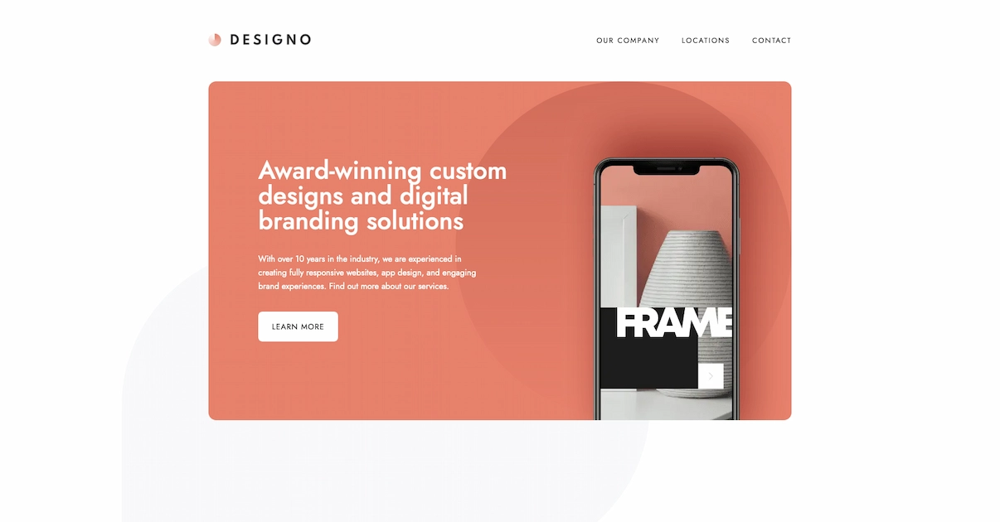

# Frontend Mentor - Designo agency website solution

This is a solution to the [Designo agency website challenge on Frontend Mentor](https://www.frontendmentor.io/challenges/designo-multipage-website-G48K6rfUT). Frontend Mentor challenges help you improve your coding skills by building realistic projects.

## Table of contents

- [Overview](#overview)
  - [The challenge](#the-challenge)
  - [Screenshot](#screenshot)
  - [Links](#links)
- [My process](#my-process)
  - [Frontend Built with](#frontend-built-with)
  - [Backend](#backend)
  - [What I learned](#what-i-learned)
- [Author](#author)

## Overview

### The challenge

Users should be able to:

- View the optimal layout for each page depending on their device's screen size
- See hover states for all interactive elements throughout the site
- See a modal after submitting form
- Receive an error message when the contact form is submitted if:
  - The `Name`, `Email Address` or `Your Message` fields are empty should show "Can't be empty"
  - The `Email Address` is not formatted correctly should show "Please use a valid email address"
- View actual locations on the locations page maps (I used [Leaflet JS](https://leafletjs.com/) for this)

### Screenshot

### Links

- Solution URL: [Fullstack Designo web](https://www.frontendmentor.io/solutions/designo-multipage-website-DDhO7KDpeO)
- Live Site URL: [https://designo-chi.vercel.app/](https://designo-chi.vercel.app/)

## My process

### Frontend Built with

- Semantic HTML5 markup
- Mobile-first workflow
- SCSS modules
- [React](https://reactjs.org/) - JS library
- [Next.js](https://nextjs.org/) - React framework
- [Typescript](https://www.typescriptlang.org/)
- [Graphql](https://graphql.org/)
- Formik and yup for contact form

### Backend

- [Strapi](https://strapi.io/) hosted on [render](https://render.com/)

### What I learned

- learned how to make graphql queries and use graphql codegen for type safe queries
- learned a lot about seo, meta tags, crawling, indexing and why it's so usefull
- learned how to setup postcss, eslint, husky and prettier for better development experienc

## Author

- Frontend Mentor - [@adurcevic](https://www.frontendmentor.io/profile/adurcevic)
